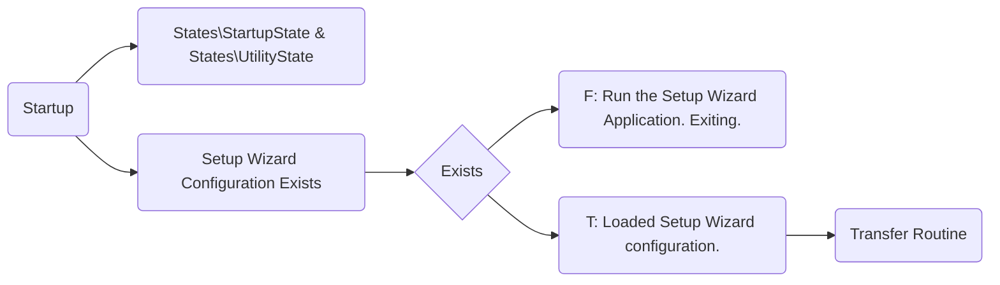

# Database.Transfer Solution
A .NET Framework/C# implementation for Actian to MicrosoftSQL and/or PostgreSQL

| Name | Resources |
| ------ | ------ |
| Front End| DatabaseTransfer.SetupWizardUi |
| Back End| DatabaseTransfer.Service |

## Service

### Flow
