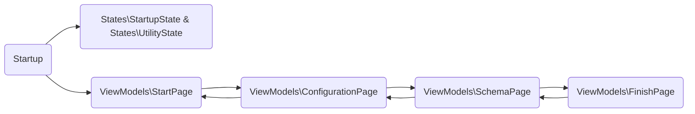


# Database.Transfer Solution
A .NET Framework/C# implementation for Actian to MicrosoftSQL and/or PostgreSQL

| Name | Resources |
| ------ | ------ |
| Front End| DatabaseTransfer.SetupWizardUi |
| Back End| DatabaseTransfer.Service |

## SetupWizard Ui

### Structure

| Namespace| Information|
| ------ | ------ |
| Forms| Leveraged forms|
| Schemas| Supporting objects for binding to Grid Control |
| States| Run time setup leveraged throughout the wizard |
| ViewModels| Behavior of the wizard|
| Views| User Controls for each corresponding view model |

### Flow

### Getting Started

#### Setup Wizard Application

+ Run DatabaseTransfer.SetupWizardUi.exe
           
+ Welcome
    + Run the setup on a server and follow the instructions.
+ Configuration
    + Set the connection strings.
+ Schedules
    + Create the schedule routines.
+ Database Schema
    + Select the tables and columns that you need transferred per routine.
+ Finish | What's Next
    + Follow the instructions and Press Finish.

#### Setup Service Application

##### Installing/Uninstalling Service
+ CD %windir%\Microsoft.NET\Framework64\v4.0.30319
+ installutil "C:\Apps\Global\PLUGINS\Database Transfer\DatabaseTransfer.Service.exe"
+ installutil "C:\Apps\Global\PLUGINS\\Database Transfer\DatabaseTransfer.Service.exe" /u

##### Service Configuration
+ C:\ProgramData\Global Shop Database Transfer

##### Service Log
+ C:\ProgramData\Global Shop Database Transfer\Logs

    + [12:46:20 INF] Starting Database Transfer As A Service.
    + [12:46:20 INF] Service Version: 1.0.0.XX.
    + [12:46:21 INF] Checking for the Setup Wizard configuration file.
    + [12:46:21 INF] Loaded Setup Wizard configuration.
    + [12:46:21 INF] Transfer [Sample] routine started.
    + [12:46:21 INF] Gathering Actian Table [ORDER_HIST_LINE] data for snapshot transfer.
    + [12:46:21 INF] Applying snapshot data to Transfer Table [ORDER_HIST_LINE].
    + [12:46:22 INF] Transfer [Sample] routine finished.

##### Notes

+ http://www.gss-updates.com/site/GShelp/2020/000/index.asp?add_ons_etl.asp

+ Deployed thru Issue Maintenance
    + ARC: 6111 - OBSOLETE
